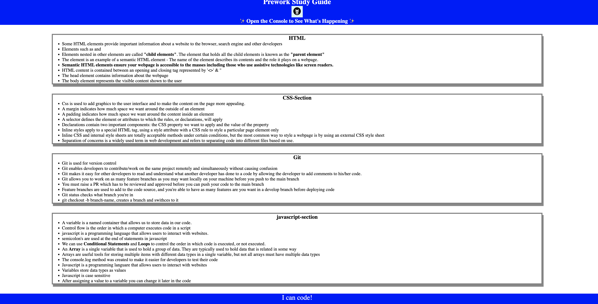

# Prework Study Guide Webpage

## Description

To visibly see my development on this bootcamp course. It was designed to practise and get a taste for what is to come in regards to this course. This study guide has reminders and notes on HTML, CSS, Javascript and Git which will come in handy during this course. I've had to do some troubleshooting during this process and had to do research to figure some stuff out. Through repetitive use of git I have picked up on how to create, stage, pull and push branches to my master branch and much more. 

## Table of Contents 

N/A

## Installation

N/A

## Usage

My Prework Study Guide is an interactive webpage which randomly selects a topic to study. I have listed the 4 topics we've practised on in this self assement HTML, GIT, CSS and Javascript. I've added notes to every section which lists the uses, defeinitions and important information about the topics. We can also use tools like Chrome devtools to inspect the webpage and see the functions working in the backend.

To add a screenshot, create an `assets/images` folder in your repository and upload your screenshot to it. Then, using the relative file path, add it to your README using the following syntax:

## Credits

N/A

## License

MIT License

Copyright (c) 2023 Deshane758

Permission is hereby granted, free of charge, to any person obtaining a copy
of this software and associated documentation files (the "Software"), to deal
in the Software without restriction, including without limitation the rights
to use, copy, modify, merge, publish, distribute, sublicense, and/or sell
copies of the Software, and to permit persons to whom the Software is
furnished to do so, subject to the following conditions:

The above copyright notice and this permission notice shall be included in all
copies or substantial portions of the Software.

THE SOFTWARE IS PROVIDED "AS IS", WITHOUT WARRANTY OF ANY KIND, EXPRESS OR
IMPLIED, INCLUDING BUT NOT LIMITED TO THE WARRANTIES OF MERCHANTABILITY,
FITNESS FOR A PARTICULAR PURPOSE AND NONINFRINGEMENT. IN NO EVENT SHALL THE
AUTHORS OR COPYRIGHT HOLDERS BE LIABLE FOR ANY CLAIM, DAMAGES OR OTHER
LIABILITY, WHETHER IN AN ACTION OF CONTRACT, TORT OR OTHERWISE, ARISING FROM,
OUT OF OR IN CONNECTION WITH THE SOFTWARE OR THE USE OR OTHER DEALINGS IN THE
SOFTWARE.

## Badges

N/A

## Features

N/A

## How to Contribute

N/A

## Tests

N/A